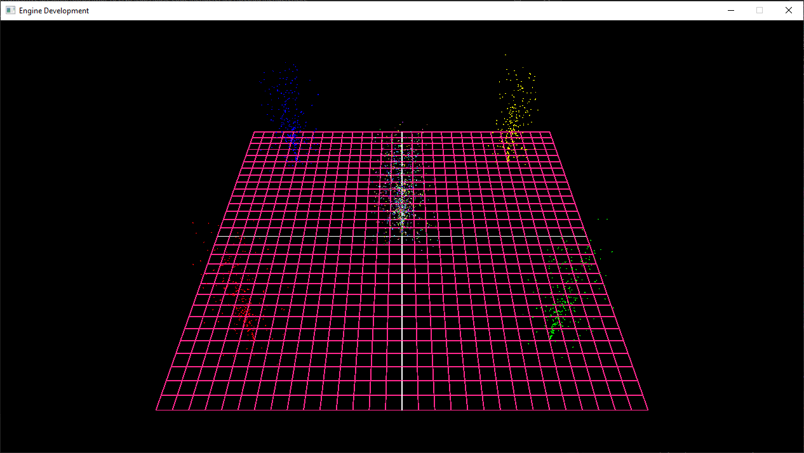
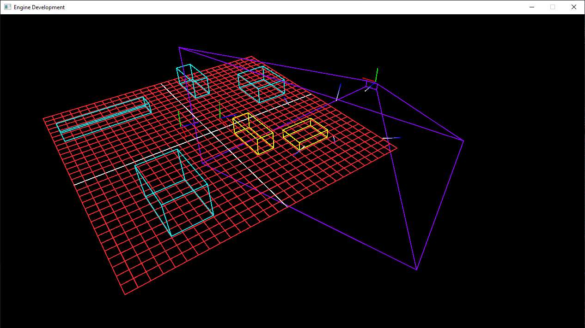

# DirectX 11 Renderer

## Skills Developed

- Memory management  
- Optimization  
- Collision
- Linear Algebra  

## Particle Emitters  

- For this lab I created particle emitters using free pools and sorted pools. The logic spawns only a few particles at a time to have a constant spray. Each frame spawns about 3 particles, then the next frame spawns 3 more, and so on.

## Frustum Culling  

- For this lab, I created several AABB (Axis-Aligned Bounding Box) which change color when the view frustum enters or leaves its vicinity.

